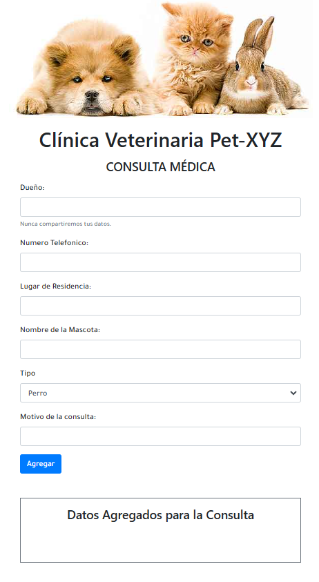

# **ANIMAL LIST MANAGEMENT SYSTEM**

This project implements an online system for a veterinary clinic (Pet-XYZ) to manage information about animals (Dogs, Cats, and Rabbits) and their owners. Users can input details like the type of animal, the owner's information (name, address, and phone number), and the reason for the consultation through a pre-built form. The system displays a detailed list at the end of the form, combining the owner's data with the pet's information, following an ES6 inheritance model for better organization and usability.

## **Technologies Used**
- **HTML5**
- **CSS3**

## **Features**
- **ES6 Classes and Inheritance**: Implements an inheritance model for managing animal types and their shared characteristics.
- **Getters and Setters**: Provides encapsulation and controlled access to the properties of the classes.
- **Dynamic Form Handling**: Captures and processes form inputs to create instances of the respective animal types dynamically.
- **User-Friendly Outputs**:
  - Displays concatenated details (owner's information and pet's details) as a list when clicking the "Add" button.
  - Generates descriptive messages like “The type of animal is a: ${this.tipo}” using class methods.
- **Reusable Methods**:
  - `datosPropietario` method available across all classes for consistent data representation.
- **Interactive Form**: Real-time identification of the selected animal type and creation of respective class instances.

## **Screenshots**
<p align="center">
  
</p>

## **Installation**
1. Clone the repository:
   ```bash
   git clone https://github.com/yadicep/inheritance_veterinary.git
